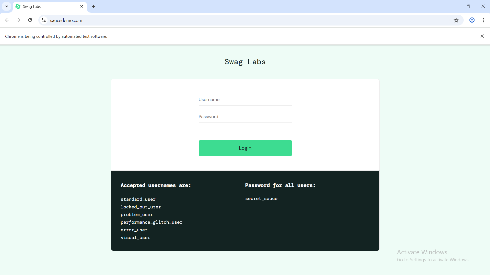
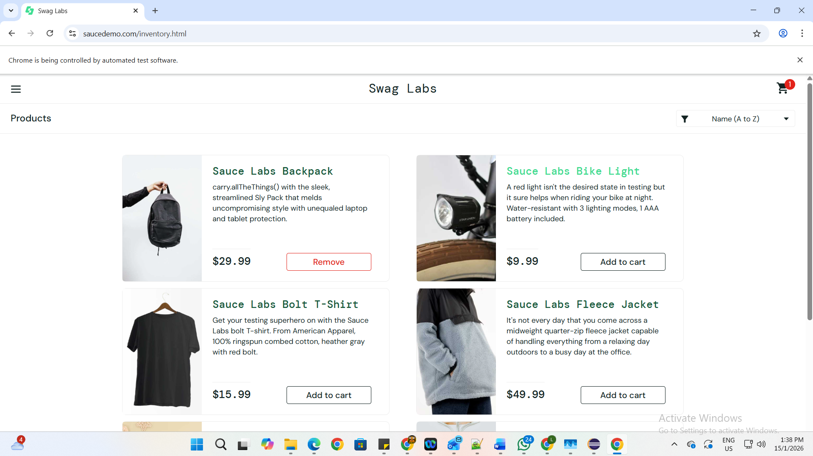
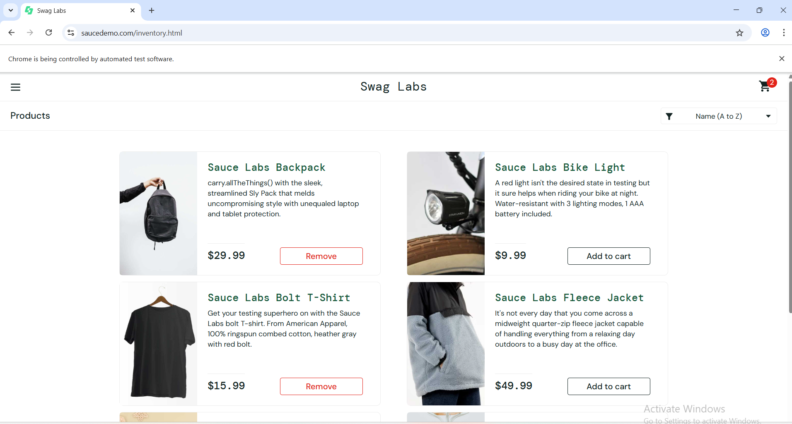

# Selenium + Cucumber BDD Automation Portfolio Project


A clean, scalable, and production-ready **UI test automation framework** built with **Selenium WebDriver**, **Cucumber (BDD)**, **TestNG**, and **Maven**.  

This project demonstrates modern automation practices by automating key flows on the public demo e-commerce site **saucedemo.com**.

### Key Features
- **Page Object Model (POM)** with reusable `BasePage` utilities for safe interactions (waits, clicks, typing)
- **Behavior-Driven Development (BDD)** using Cucumber Gherkin scenarios (readable by non-technical stakeholders)
- **Configuration-driven testing** — credentials and base URL from `config.properties` (no hard-coded values)
- **Hooks** for browser lifecycle management (setup/teardown)
- **Positive & negative scenarios** — login success/failure, cart addition (single & multiple items)
- **Assertions** on URL redirection and UI elements (cart badge count)
- **Reusable components** — `BasePage` methods inherited by all page objects
- **Clean structure** ready for scaling to large applications

### Tech Stack
- **Java** 17
- **Selenium WebDriver** 4.16.1
- **Cucumber** 7.15.0 (BDD)
- **TestNG** 7.9.0 (test runner)
- **Maven** (dependency & build management)
- **WebDriverManager** (automatic ChromeDriver download)

### Project Structure

cucumber_002/
├── src/
│   ├── main/
│   │   └── java/com/lugendran/utils/
│   │       ├── BasePage.java          # Reusable actions (click, type, wait)
│   │       └── ConfigReader.java      # Reads config.properties
│   └── test/
│       ├── java/com/lugendran/
│       │   ├── hooks/
│       │   │   └── Hooks.java         # Browser setup & teardown
│       │   ├── pages/
│       │   │   ├── LoginPage.java
│       │   │   └── InventoryPage.java
│       │   ├── runners/
│       │   │   └── TestRunner.java    # Cucumber TestNG runner
│       │   └── stepdefinitions/
│       │       ├── LoginSteps.java
│       │       └── InventorySteps.java
│       └── resources/
│           ├── features/
│           │   ├── Login.feature
│           │   ├── AddToCart.feature
│           │   ├── CartMultiple.feature
│           │   └── LoginInvalid.feature
│           └── config.properties      # base.url, username, password
├── pom.xml                                # Dependencies & build config
└── README.md                              # This file


### How to Run Locally
1. **Clone** the repository:
   ```bash
   git clone https://github.com/Lugendran/selenium-cucumber-portfolio.git
   cd selenium-cucumber-portfolio
   
mvn clean install
mvn test

### Screenshots

**Login Page**
  


**Inventory Page after Login**
  


**Cart with 2 Items**
  


**Console Output – All Passed**
  
