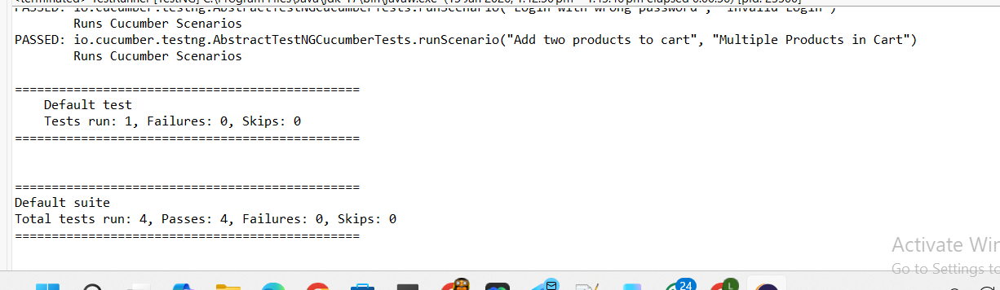

# Selenium + Cucumber BDD Automation Portfolio Project


Professional UI test automation framework for the public demo e-commerce site **saucedemo.com**.

### Key Features
- Page Object Model (POM) with reusable `BasePage` utilities
- Behavior-Driven Development (BDD) using Cucumber (Gherkin scenarios)
- Configuration-driven testing (credentials from `config.properties`)
- Hooks for browser setup/teardown
- Positive & negative test scenarios (login, invalid login, add to cart)
- Assertions on URL and UI elements (cart badge count)
- Clean, maintainable structure ready for scaling

### Tech Stack
- Java 17
- Selenium WebDriver 4
- Cucumber 7 (BDD)
- TestNG 7.9 (runner)
- Maven (build & dependency management)
- WebDriverManager (auto browser drivers)

### Project Structure# selenium-cucumber-portfolio


#### 2. Add Screenshots (Visual Proof)

1. Run tests again (with pause in `Hooks.java` if needed)
2. Take 3–4 screenshots:
   - Login page
   - Inventory page after login
   - Cart badge "1" or "2"
   - Console showing PASSED
3. Create folder `screenshots` in project root
4. Add screenshots there
5. Update README with images:

```markdown
### Screenshots

**Successful Login**  


**Cart with 2 items**  


**Console Output**  


